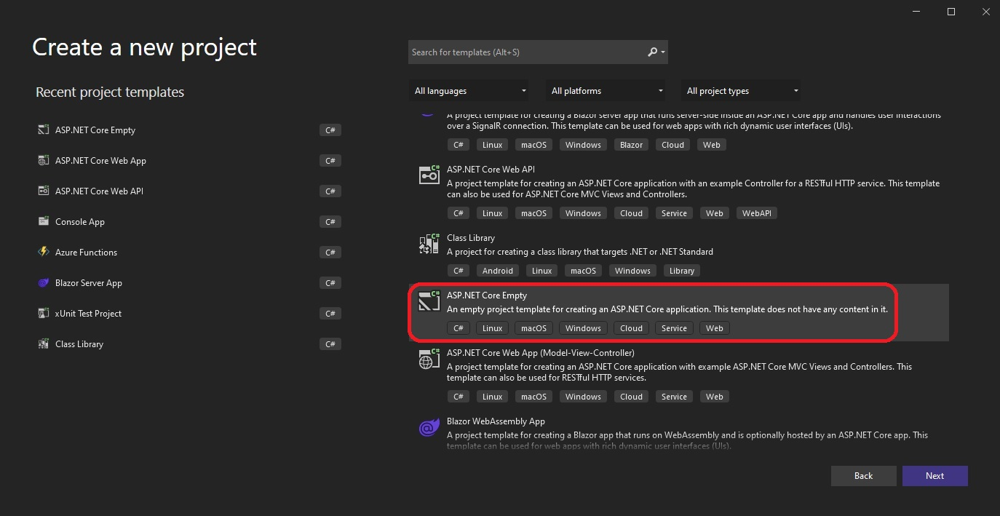

# Create a new empty we project.

- Create an empty web project.

- Use Vs studio 2022 to create as follows.

- Use the following command, if you want to use dotnet cli.
  - dotnet new web --name Test 

