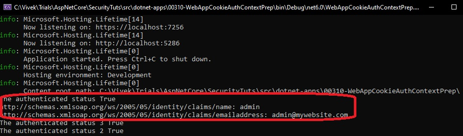

# Asp.net core Web app with login page.

- This builds from the previous example.

- In this example, we will create a claims principal if the user name and pass are correct.
  - See the file .\WebAppCookieAuthContextPrep\Pages\LoginLogout\Login.cshtml.cs
  - Inside of it, see the method **public async Task<IActionResult> OnPost()**

```ps
 // Creating the security context
 var claims = new List<Claim> {
     new Claim(ClaimTypes.Name, "admin"),
     new Claim(ClaimTypes.Email, "admin@mywebsite.com")
 };
 
 var identity = new ClaimsIdentity(claims, Constants.AuthTypeSchemeName);
 // We are creating the claims principal, which is the security context.
 
 var claimsPrincipal = new ClaimsPrincipal(identity);
 
 await HttpContext.SignInAsync(Constants.AuthTypeSchemeName, claimsPrincipal);
 
 return RedirectToPage("/Index");
```

- Next configure a service like this the program.cs file. Basically we are adding cookie authentication

```
builder.Services.AddAuthentication(Constants.AuthTypeSchemeName).AddCookie(Constants.AuthTypeSchemeName, options =>
{
    options.Cookie.Name = Constants.AuthTypeSchemeName;
});
```

- Also a few middle wares are sprinkled here are there, to console writeout, IsAuthenticated flag. 

- So now SignInAsync here is serializing the claimsPrincipal, encrypt it, and then  save that as a cookie in the http context and send that back in the response.

```cs
await HttpContext.SignInAsync(Constants.AuthTypeSchemeName, claimsPrincipal);
```

- The above will throw exception if you do not configure a handler. 



- You should configure a handler at the composition root, in the Program.cs file as follows.

```cs 
var authBuilder = builder.Services.AddAuthentication(Constants.AuthTypeSchemeName);
authBuilder.AddCookie(Constants.AuthTypeSchemeName, options =>
{
    options.Cookie.Name = Constants.AuthTypeSchemeName;
});
```

- If you comment that out, you will see an exception being thrown by HttpContext.SignInAsync. Try it and see.

- Auth middle ware. This middleware, looks at the request, checks if there are any cookies related to authentication. Then reads them, and then populates the security context.

- Take a look at [this so answer](https://stackoverflow.com/a/74038922/1977871).

```cs
app.UseAuthentication();
```

- So the **UseAuthentication** middle ware reads the Auth Cookie if any. 

- Also note the following code, where in we are printing out the claims that the authenticated user has when the user is authenciated 
- Run the app, do the login to get Authenticated, then check the output corresponding to the following code.

```cs
app.Use(async (context, next) =>
{
    Console.WriteLine($"The authenticated status {context.User.Identity!.IsAuthenticated}");
    if (context.User.Identity.IsAuthenticated)
        context.User.Claims.ToList().ForEach(x => Console.WriteLine(x));
    
    await next.Invoke();
    Console.WriteLine($"The authenticated status 3 {context.User.Identity!.IsAuthenticated}");
});
```


