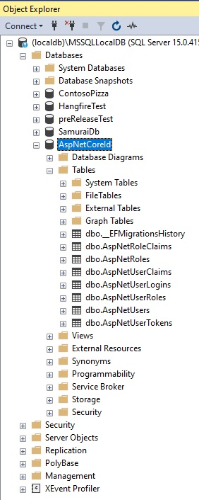

# Web App Aspdotnet core identity.

- Adds a user register page to a blank web app.
  - The starting template to the web app is [this dotnet razor page web pack solution](https://github.com/AvtsVivek/webpacktuts/tree/main/code/600500-aspnetcore-webapp-webpack)
  - 

- Add necessary nuget packages
  ```xml
  <ItemGroup>
    <PackageReference Include="Microsoft.AspNetCore.Authentication.Google" Version="6.0.10" />
    <PackageReference Include="Microsoft.AspNetCore.Identity.EntityFrameworkCore" Version="6.0.10" />
    <PackageReference Include="Microsoft.EntityFrameworkCore.SqlServer" Version="6.0.10" />
    <PackageReference Include="Microsoft.EntityFrameworkCore.Tools" Version="6.0.10">
      <PrivateAssets>all</PrivateAssets>
      <IncludeAssets>runtime; build; native; contentfiles; analyzers; buildtransitive</IncludeAssets>
    </PackageReference>
  </ItemGroup> 
  ```
- Add the following db context class in the Data folder
  ```cs
  public class AppDbContext : IdentityDbContext
  {
      public AppDbContext(DbContextOptions<AppDbContext> options) : base(options)
      {
      }
  }
  ```  
- Configure the services to let the di container know about the db context.

  ```cs
  builder.Services.AddDbContext<AppDbContext>(options =>
  {
      options.UseSqlServer(builder.Configuration.GetConnectionString("Default"));
  });
  ```
- Add a connection string setting to app settings file.
  ```json
  "ConnectionStrings": {
    "Default": "Data Source=(localdb)\\MSSQLLocalDB;Initial Catalog=AspNetCoreId;Integrated Security=True"
  }
  ```

- Using SSMS create a new database of name AspNetCoreId

- Now run the add migration command. Then update command.
  ```ps
  dotnet ef migrations add InitialMigration

  dotnet ef database update InitialMigration
  ```
- Inspect the database for the tables created.




- Add Id Service to the container.
  ```cs
  builder.Services.AddIdentity<IdentityUser, IdentityRole>(
        options =>
        {
            options.Password.RequiredLength = 8;
            options.Password.RequireLowercase = true;
            options.Password.RequireUppercase = true;

            options.Lockout.MaxFailedAccessAttempts = 5;
            options.Lockout.DefaultLockoutTimeSpan = TimeSpan.FromMinutes(15);

            options.User.RequireUniqueEmail = true;
        }
    ).AddEntityFrameworkStores<AppDbContext>().AddDefaultTokenProviders();
  ```
- Add the middleware
  ```cs
  app.UseAuthentication();
  ```
- Add a register page in the Account folder inside of the pages folder.
- Essentially calling the CreateAsync to create a user.
```cs
var result = await userManager.CreateAsync(user, RegisterViewModel.Password);
```

