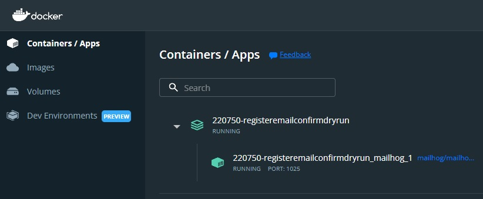
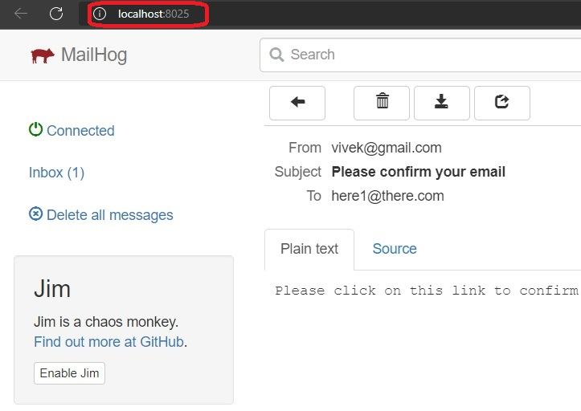

# Web App Aspdotnet core identity.

- This builds on the previous example. That example has a register, login and logout are implimented.
- This example adds an email confirmation page.
- Add ConfirmEmail page.
- In the Register page, at code to redirect to confirm email page

```cs
if (result.Succeeded)
{
    var confirmationToken = await _userManager.GenerateEmailConfirmationTokenAsync(user);
    return Redirect(Url.PageLink(pageName: "/Account/ConfirmEmail",
        values: new { userId = user.Id, token = confirmationToken })!);
}
```

- So the idea here is the user manager generates a token. 
- Note, when generating the token, the _userManager.GenerateEmailConfirmationTokenAsync(user); the method needs a seed, user object in this case. 
- Based on that the method generates a hash(a key and hasing algo is also need, but that is taken care of internally)
- This token is sent to the user email address.
- And when the user clicks the link in the email, that token is sent to the server. Then at the server, the token is validated.
- It is validated as following.

```cs
var result = await _userManager.ConfirmEmailAsync(user, token);
```

- Now here again the seed, which is the user boject is needed during the validation. The ConfirmEmailAsync method again generates the hash and then compares with the token. If they match then they are validated.

- In this example, we are actually sending an email. The email server used here is mail hog locally running on docker. 
- Ensure the following commands are run. Docker desktop is needed. 
```ps
docker-compose up -d mailhog

start http://localhost:8025
```



- Run the app, click register link to register a new user.
- Now check the mail in the mail box(browse to http://localhost:8025)
- Check the email you recieved, then click the link in it.
- 